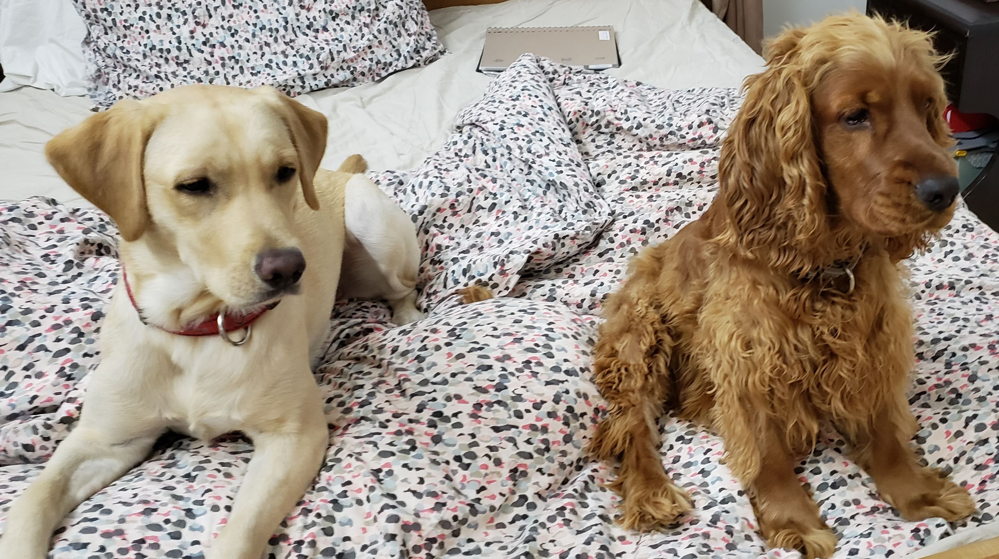

# Luke Menezes: My GitHub User Page

## About me
**Senior** at *UCSD* studying ***Computer Engineering***

**I have _2 dogs back home_, here is a [section link](https://github.com/LJMNZS/Pages-Project/blob/Markdown/index.md#other-interesting-things) to see a picture of them**

Task Lists: Classes I am ~~hopefully~~ completing this quarter
- [ ] CSE 110
- [ ] CSE 130
- [ ] CSE 158
- [ ] ECE 111

Ordered list: Classes I have left to graduate
1. CSE 120
2. CSE 141L
3. CSE/ECE Elective 1
4. CSE/ECE Elective 2
5. CSE/ECE Elective 3
6. CSE/ECE Elective 4

## About me as a programmer
Unordered list of some programming languages I know with code snippets
- Java
  ```
  public class HelloWorld
    {
        public static void main(String args[])
        {
            System.out.println("Hello World");
        }
    }
  ```
- Python
  ```
  print("Hello World")
  ```
- C++
  ```
  #include <iostream>
  int main() {
      std::cout << "Hello World" << std:endl;
      return 0;
  }
  ```
- C
  ```
  #include <stdio.h>
  int main()
  {
      printf("Hello World");
      return 0;
  }
  ```

## Other interesting things
External links: This site was built using [GitHub pages](https://pages.github.com/).

Relative link: Here is a link to the [README](./README.md) of this repo

I didn't really have a good picture of myself so here is a picture of my dogs:


Finally, a programming quote by anonymous:
> The best thing about boolean is that even if you are wrong, you are only off by a bit